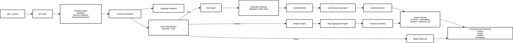

## 1. Problem Framing

Fraud Agents Enhanced addresses a **hybrid fraud intelligence problem** that sits between
*qualitative regulatory knowledge* and *quantitative transaction analytics*.

In real-world fraud teams, analysts must constantly answer two fundamentally different
classes of questions:

1. **Knowledge-driven fraud questions**  
   - *“What are the dominant card-not-present fraud techniques?”*  
   - *“Which merchant behaviors are associated with higher fraud exposure?”*  
   - *“How does cross-border fraud differ inside vs outside the EEA?”*  

2. **Data-driven fraud questions**  
   - *“How does the daily or monthly fraud rate evolve over time?”*  
   - *“Which merchants or categories have the highest observed fraud rate?”*  
   - *“What patterns emerge when aggregating fraud transactions by region?”*

Most systems incorrectly treat these as the **same problem**.

---

### Why simple rules fail

Rule-based systems break down quickly because:

- Fraud tactics evolve faster than static rules
- Rules cannot explain *why* a pattern exists
- Maintenance cost grows non-linearly with rule count
- Regulatory or research-based knowledge cannot be encoded reliably as rules

---

### Why standalone ML models are insufficient

Pure ML approaches also fail in isolation:

- Models optimize for prediction, not **explanation**
- They cannot answer conceptual or regulatory questions
- Analysts still need narrative, traceability, and citations
- Black-box outputs are hard to justify in audits or investigations

---

### Core insight

**Fraud intelligence is not a single-model problem.**

It requires:
- **Retrieval-Augmented Generation (RAG)** for grounded, explainable knowledge
- **Analytical computation** for time-series and aggregation logic
- **Orchestration and routing** to decide *which reasoning mode applies per query*

Fraud Agents Enhanced is designed explicitly around this separation.


## 2. System Architecture

Fraud Agents Enhanced is built as a **modular, agent-orchestrated system**
that dynamically routes each user query to the correct reasoning pathway.

At a high level, the system consists of four cooperating layers:
- Input & Guardrails
- Orchestration & Routing
- Reasoning Engines (RAG or Analytics)
- Output Scoring & Validation


### Agents

The system is composed of specialized agents, each with a clearly defined role:

- **Guardrail Agent**
  Validates user input, detects prompt injection, enforces domain boundaries,
  and normalizes multilingual input.

- **Intent Classification Agent**
  Determines whether a query requires:
  - knowledge retrieval (RAG),
  - data computation (analytics), or
  - rejection (out of domain).

- **RAG Agent**
  Answers conceptual, regulatory, and fraud-methodology questions using
  document-grounded retrieval and citation-based generation.

- **Analytics Agent**
  Executes aggregation, ranking, and time-series computation over
  transaction data (e.g. fraud rate, merchant risk).

- **Scoring & Insight Agent**
  Evaluates answer quality using heuristic, embedding, numeric consistency,
  and optional LLM-based evaluation, then generates higher-level insights.


### Orchestration and Routing

A central orchestrator coordinates all agents.

For every query, the orchestrator:
1. Sanitizes and validates input
2. Detects user language
3. Classifies intent using a hybrid heuristic + LLM approach
4. Routes the query to the appropriate reasoning engine
5. Applies confidence scoring and fallback logic
6. Returns a structured, traceable response

This design ensures that **RAG and analytics are never mixed accidentally**,
preventing incorrect reasoning paths.

### RAG vs Analytics

The system enforces a strict separation:

- **RAG is used when:**
  - answering "why" or "what" questions
  - explaining fraud techniques or regulatory findings
  - grounding answers in reports and documentation

- **Analytics is used when:**
  - numerical computation is required
  - trends, rankings, or aggregations are requested
  - results must be derived from transaction data

This boundary is critical. Treating all questions as RAG or all as analytics
leads to either hallucination or unnecessary computation.

### Multilingual Support

Fraud Agents Enhanced natively supports English and Indonesian.

Language detection occurs early in the pipeline and is preserved throughout:
- queries may be rewritten or translated for internal processing
- answers are always returned in the user's original language

This design reflects real fraud operations in multilingual regions,
where analysts and regulators work across languages.

### System Architecture Diagram

The following diagram shows the high-level architecture of **AI Fraud Agents Systems**,
including orchestration, routing logic, and the separation between RAG and analytics.


> Source diagram (Mermaid): [docs/architectures.mmd](docs/architectures.mmd)

## 3. Key Design Decisions

### Why Intent-Based Routing

Fraud-related questions are not homogeneous.

Some queries require:
- factual explanation grounded in documents (e.g. fraud typologies),
while others require:
- numerical computation over transactional data (e.g. fraud rate trends).

A single-model or single-RAG pipeline cannot reliably handle both.
This system explicitly classifies intent and routes each query
to the correct reasoning path, reducing hallucination and misuse
of language models.

### Why Hybrid RAG + Analytics

Using RAG for analytical questions leads to fabricated numbers.
Using analytics for conceptual questions leads to shallow explanations.

Fraud Agents Enhanced separates these concerns:

- **RAG** is used for:
  - regulatory interpretation
  - fraud methodology
  - document-grounded explanations

- **Analytics** is used for:
  - fraud rate computation
  - merchant/category ranking
  - time-series analysis

This hybrid design ensures correctness, interpretability,
and operational trust.

### Why Multilingual Support Matters

Fraud operations are inherently multilingual.

Analysts, regulators, and compliance teams often operate in
different languages while referencing the same underlying data.

The system preserves user language across:
- intent classification
- query rewriting
- final response generation

This avoids silent translation errors and improves adoption
in real operational environments.

### Why Cost Tracking Is Mandatory

LLM-based systems incur variable and opaque costs.

Fraud Agents Enhanced includes:
- per-call token usage estimation
- session-level cost accumulation
- automatic fallback to cheaper models when thresholds are exceeded

This makes the system economically predictable and deployable
in production environments with budget constraints.

### Why Scoring and Fallback Exist

Not all model outputs are equally reliable.

The system scores each answer using:
- heuristic grounding checks
- embedding similarity
- numeric consistency
- optional LLM-based evaluation

Low-confidence answers trigger explicit fallback responses
instead of silently returning misleading outputs.

## 4. Failure Modes & Safeguards

### Failure: Incorrect Reasoning Path

A common failure in AI systems is routing analytical questions to RAG
or conceptual questions to data pipelines.

Safeguard:
- Hybrid intent classification using heuristic rules and LLM verification
- High-confidence heuristic decisions bypass LLM calls
- Low-confidence cases trigger LLM-based intent confirmation

### Failure: Hallucinated or Ungrounded Answers

Language models may generate plausible but unsupported explanations,
especially when context is weak or ambiguous.

Safeguard:
- Strict context-only prompting
- Fallback responses when confidence is below threshold
- Scoring based on grounding, semantic similarity, and numeric consistency

### Failure: Numerical Inconsistency

Generated answers may contain numbers that do not exist in the source data,
which is unacceptable in fraud analysis.

Safeguard:
- Numeric extraction from answers and source context
- Consistency scoring between answer and retrieved evidence
- Penalization of mismatched values in final confidence score

### Failure: Prompt Injection or Unsafe Queries

Users may attempt to override system instructions or query outside
the supported fraud domain.

Safeguard:
- Input sanitization and length constraints
- Prompt-injection pattern detection
- Strict domain allowlist enforcement
- Explicit reject responses for out-of-scope queries

### Failure: Cost Explosion

Uncontrolled LLM usage can lead to unpredictable operational costs.

Safeguard:
- Session-level cost tracking
- Hard cost thresholds
- Automatic fallback to cheaper models
- Optional disabling of expensive evaluation components

### Failure: System Breakage in CI or Offline Environments

Many AI systems fail during CI due to missing secrets or external dependencies.

Safeguard:
- Lazy initialization of external clients
- Feature flags to disable LLM, embeddings, and retrievers
- Deterministic fallback behavior during tests

## 5. What’s Simplified (Explicit Tradeoffs)

### Simplification: No Custom Model Hosting or Fine-Tuning

This system uses hosted LLM APIs rather than self-hosted or fine-tuned models.

Why:
- Focus is on system architecture, routing, and safeguards
- Model quality is treated as an interchangeable dependency

Production Mapping:
- Replace API models with fine-tuned or self-hosted models if required
- The LLM interface is abstracted to allow drop-in replacement

### Simplification: Small-Scale Vector Store

The vector database contains a limited number of documents
designed to demonstrate retrieval logic rather than large-scale indexing.

Why:
- Emphasizes correctness, grounding, and explainability
- Avoids premature optimization

Production Mapping:
- Scale to millions of chunks using sharded vector databases
- Introduce caching, ANN tuning, and refresh pipelines

### Simplification: Partial LLM-Based Evaluation

LLM-based evaluators (e.g., Phoenix) are optional and disabled by default.

Why:
- Keeps CI deterministic and fast
- Avoids external dependencies during testing

Production Mapping:
- Enable continuous evaluation with sampled traffic
- Persist evaluation metrics for drift detection and QA dashboards

### Simplification: Session-Level Cost Tracking

Cost controls are enforced at session scope rather than
per-user, per-team, or per-tenant.

Why:
- Demonstrates cost-awareness without infrastructure complexity

Production Mapping:
- Introduce per-user or per-tenant quotas
- Integrate billing, usage dashboards, and alerts

### Simplification: No End-User Authentication

The system does not implement authentication, authorization,
or role-based access control.

Why:
- Focus is on AI decision-making rather than identity management

Production Mapping:
- Add OAuth/JWT-based authentication
- Enforce role-based permissions and audit logging

### Simplification: Lightweight UI for Demonstration

The UI is designed for inspection and demonstration, not enterprise UX.

Why:
- Primary value lies in backend reasoning and safeguards

Production Mapping:
- Replace UI with internal dashboards or integrate with existing platforms

## 6. How This Maps to Real Production

### CI/CD & Quality Gates

This project includes a CI pipeline that enforces:

- Static analysis (linting)
- Import-level system integrity tests
- Deterministic test execution (LLM calls disabled in CI)
- Container build verification

Why this matters:
- Prevents regressions in orchestration logic
- Ensures safety-critical components always load correctly

Production Mapping:
- Extend tests with shadow traffic evaluation
- Add regression tests for routing, guardrails, and fallback behavior

### Deployment Strategy

The system is deployed as a stateless FastAPI service.

Characteristics:
- API-first design
- No session affinity required
- Horizontal scaling friendly

Production Mapping:
- Deploy behind a load balancer
- Use rolling deployments with zero downtime
- Separate control-plane (routing, safety) from execution-plane (LLMs)

### Scaling Considerations

The architecture scales along multiple dimensions:

- **Traffic scale** → Stateless API + autoscaling
- **Data scale** → Independent scaling of analytics DB and vector store
- **Model scale** → Model abstraction allows easy replacement

Production Mapping:
- Introduce async execution for heavy analytics
- Add request prioritization and rate limiting

### Observability & Monitoring

The system emits structured logs at each decision boundary:

- Intent classification
- Routing decisions
- Cost accumulation
- Fallback activation
- Error conditions

Production Mapping:
- Centralize logs and traces
- Add alerting on anomaly rates, cost spikes, and failure patterns
- Track answer confidence over time

### Reliability & Failure Isolation

The system is designed with graceful degradation:

- Analytics failure → fallback messaging
- Retrieval failure → safe refusal
- LLM failure → deterministic error handling
- Low-confidence output → fallback response

Production Mapping:
- Add circuit breakers for external APIs
- Implement retry budgets and backoff strategies

### Security & Governance Readiness

While simplified in this project, the architecture supports:

- Strict domain enforcement
- Prompt-injection protection
- Controlled model access
- Audit-friendly request flows

Production Mapping:
- Add authentication & authorization
- Persist audit logs for compliance
- Enforce policy-based routing

This project is intentionally designed to demonstrate **system-level AI engineering**:
not model tuning, but **decision-making, safety, reliability, and production readiness**.

It reflects how modern AI systems are built and operated in real enterprise environments.

---

## Live API Usage

The API is publicly deployed and accessible at:

Production API:
https://ai-fraud-agent.onrender.com

Interactive API Docs (Swagger):
https://ai-fraud-agent.onrender.com/docs

### Example Request

```bash
curl -X POST https://ai-fraud-agent.onrender.com/query \
  -H "Content-Type: application/json" \
  -d '{"query":"What are the main types of credit card fraud?"}'
```
---

### Optional Local UI (Streamlit)

A Streamlit-based UI is included for local exploration and demos.

Run locally:
```bash
streamlit run ui/app.py
```

